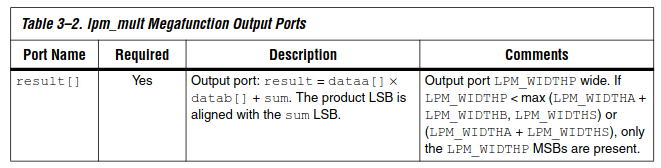

# DSD Coursework

Luigi Rinaldi and Diego Van Overberghe

## Task 1

- Installed Quartus Lite 20.1 using [this guide](https://mil.ufl.edu/3701/docs/quartus/quartus22.1_installation.pdf).
  - Needed to install a gtk-type package, no issue via pacman, fiddled with locales to activate `en_US` although this was not required, added to path by adding in `.bashrc` 

- Installed Eclipse using [this guide](https://www.terasic.com.tw/wiki/Getting_Start_Install_Eclipse_IDE_into_Nios_EDS).
  - Missing gtk package, installed via pacman
  - Issue related to missing definition of a freetype function, resolution is to disable the default quartus bundled version of freetype at `~/intelFPGA_lite/20.1/quartus/linux64/jre64/lib/amd64/libfreetypeso.6`.
- Blasted to board, no issues, but would not upload with `nios2-download-elf`, saying device not responding. After trying to use Eclipse IDE to run as NIOS II hardware, I see the System ID error as mentioned in the documentation. I realised my top level wires were overlapping and not actually connected. After properly connecting them, I recompiled, blasted and was able to run `nios2-download-elf` and see `Hello from NIOS II!` on the terminal.
- Finally, I created an alias in my `.bashrc` to invoke `nios2_command_shell.sh` with `shell`. Then tested compiling and flashing the program directly from VSCode using `make download-elf`. After an initial issue with a wrong timestamp‽ which required me to recompile the entire project, I was able to successfully flash without using the Eclipse IDE. Also tested changing the program to ensure it was not using a cached result.

Using the Compilation Report and looking into the fitter section, we see the following utilisation:

- Total Logic Elements: 1 365 out of 32 070 (4%)
- Total Memory Bits: 210 048 out of 4 065 280 (5%)
- Total DSP Blocks: 0 out of 87 (0%)
- Total PLLs: 0 out of 6 (0%)

## Task 2

To begin, we copy the program from the spec pdf. The code to divide by 1024 is simplified by casting the float to an int, then shifting right 10.

- With initial `onchipMem` size 20480 bits:

  - When trying to add the `gcvt` to calcuate the delay, the script tell us that the program no longer fits on the onchip mem and is overflowing by 20k+.

  - When running the tests, we get results for the first test case but not for the other two, so it would seem that there is not enough memory to run the `generateVector` function which commits the vector to memory.
- Doubling `onchipMem` to 40,960 bits, we are able to do the first and second test cases.
  - Total Memory Bits: 374,016 / 4,065,280 (9%), others remained identical.
  - For the third test case, we can see that the `sumVector` function is run successfully, but does not return the result back to main.
  - `gcvt` is no longer working and the compiler says the function is not defined
- We tried pushing `onchipMem` to 409,600 and the design no longer fitted on the board. Doubling was not enough, utilisation now 702,080 / 4,065,280 (17%).
- Going to 245,760 bits, we have 2,012,672 / 4,065,280 (50%) memory bit usage. This is still not enough to run the third test.
- Maximising the `onchipMem` at 390,000 with 3,166,720 / 4,065,280 (78%), we are still not able to run test 3. Doing some back of the napkin calculations, we determine that the third test requires `216000 * 32 / 8` bytes of memory, which amounts to 1 MB. The maximum available within board is about 4e9 / 8 ≈ 0.5 MB
- We try reducing N to 90k and are able to run the program. Using the `nios2-elf-size` command, we determine that the program is 14kB in size which leaves ~375kB of memory available, which corresponds to a value of N around 90k.

- Different vector sizes only marginally change the size of the `.elf`, we explain this by considering that the test cases with larger numbers simply require more space to store the test number. For example, test one requires 14036 B, while replacing N = 52 with N = 5200 only increases the size to 14064 B, which corresponds to the weight of storing the larger N.
- By casting the difference of the timers to float, we are able to get `gvct` to work, test cases 1 runs in 1 "tick" = 0.85ms, test 2 in 34ms and task 3 does not run with N=90k due to the available memory being smaller due to the loading of `gvct`. With N=40k we get 1.176s. The timing is based on an average of 100 executions.
- Comparing with a Python implementation, we see a small difference the integer part of our calculated value. We put this down to innacuracies of single precision float. By changing all the floats to double, we are able to get exactly the same result as the Python script.
- We would expect that reducing the `onchipMem` would not effect the speed of the computation. Reducing the size to 200kB instead of 390kB, we get an execution time of 0.85ms for test 1 and 35ms for test 2. These numbers are essentially the same and so we seem to be able to validate our hypothesis that the memory size has little to no bearing on the latency.
- The little difference seen on test 2 (1ms) could be attributed to ...

### Compiler Flags

Tested on 128 iterations

| Flag   | Test 1       | Test 2 | size  |
| ------ | ------------ | ------ | ----- |
| -O0    | 108          | 4288   | 13872 |
| -O1    | 5 (for 2^16) | 27     | 13632 |
| -O2    | 85           | 3320   | 13760 |
| -O3    | 85           | 3327   | 13748 |
| -Ofast | 85           | 3345   | 13748 |
| -Os    | 0            | 0      | 13748 |


## Task 3

### Adding the Offchip Mem

- Added offchip mem initially in Platform Designer, but it didn't work so we addded it with the megawizard instead, this worked fine.

### Offchip Mem Test Results

For test 1, each iteration took 1.125 ms to execute. 
For test 2, each iteration took 44.16ms to execute.
We are now able to run test 3 and each iteration took 5367.5ms.

The computed result is 5693058048.000000. 
Simulating in python yields 5693101440.041504, which corresponds to a relative error of 7.6-06.
Chaning the program to use doubles reduces the error to 0 as the simulation also uses double precision floating points.

### Evaluating perfomance on test 3

-Os breaks the timing function (we think) and it seems like the performance is equivalent to the -O1 optimisation.

| Flag   | I 2k, D 2k | I 2k, D 4k | I 2k, D 8k | I 4k, D 2k | I 8k, D 2k | size of elf |
| ------ | ---------- | ---------- | ---------- | ---------- | ---------- | ----------- |
| -O0    | 6033       | 6015       | 6006       | 3924       | 3914       | 76484 b     |
| -O1    | 4745       | 4697       | 4691       | 3646       | 3627       | 76236 b     |
| -O2    | 4736       | 4727       | 4722       | 3644       | 3639       | 76400 b     |
| -O3    | 4739       | 4723       | 4726       | 3644       | 3640       | 76368 b     |
| -Ofast | 4709       | 4733       | 4728       | 3644       | 3641       | 76368 b     |
| -Os    | 5066       | 5049       | 5041       | 3679       | 3674       | 76240 b     |

#### Nonsensical rambling
For -O2, O3 and Ofast optimisation settings it seems like the numbers of iterations performed to average the timing of the function affects the performance. 
This could be explained by considering how the compiler unrolls the iteration roop and the `sumVector` loop, where the situation of 2 iterations is some sort of sweet spot that allows the optimal amount of unrolled instructions to fit into the cache. Any more timing iterations and the compiler doesn't unroll the timing loop and unrolls too many of `sumVector` iterations to the point where they don't fit in the cache; with a single timing iteration the compiler also tries to fully unroll the `sumVector` leading to too many instructions for the cache to handle. With two iterations it is possible the compiler unrolls the timing loop entirely into two successive `sumVector` instructions, but each of these are unrolled less leading to fewer instructions which can better fit in the cache?

dump of the -O2 optimisation for 4 iterations
```asm
  8003e4:	00000106 	br	8003ec <main+0x88>
  8003e8:	84000104 	addi	r16,r16,4
  8003ec:	1009883a 	mov	r4,r2
  8003f0:	014ea034 	movhi	r5,14976
  8003f4:	08004f80 	call	8004f8 <__addsf3>
  8003f8:	80800015 	stw	r2,0(r16)
  8003fc:	847ffa1e 	bne	r16,r17,8003e8 <main+0x84>
  800400:	d8800017 	ldw	r2,0(sp)
  800404:	04c00434 	movhi	r19,16
  800408:	d5670d17 	ldw	r21,-25548(gp)
  80040c:	9cfc0104 	addi	r19,r19,-4092
  800410:	05000104 	movi	r20,4
  800414:	14e7883a 	add	r19,r2,r19
  800418:	dc000017 	ldw	r16,0(sp)
  80041c:	0025883a 	mov	r18,zero
  800420:	84400017 	ldw	r17,0(r16)
  800424:	84000104 	addi	r16,r16,4
  800428:	880b883a 	mov	r5,r17
  80042c:	8809883a 	mov	r4,r17
  800430:	08009540 	call	800954 <__mulsf3>
  800434:	880b883a 	mov	r5,r17
  800438:	1009883a 	mov	r4,r2
  80043c:	08004f80 	call	8004f8 <__addsf3>
  800440:	9009883a 	mov	r4,r18
  800444:	100b883a 	mov	r5,r2
  800448:	08004f80 	call	8004f8 <__addsf3>
  80044c:	1025883a 	mov	r18,r2
  Extra bne
  800450:	9c3ff31e 	bne	r19,r16,800420 <main+0xbc>
  800454:	a53fffc4 	addi	r20,r20,-1
  800458:	a03fef1e 	bne	r20,zero,800418 <main+0xb4>
  80045c:	1009883a 	mov	r4,r2
  800460:	08015880 	call	801588 <__extendsfdf2>
  800464:	01002074 	movhi	r4,129
  800468:	d4270d17 	ldw	r16,-25548(gp)
  80046c:	180d883a 	mov	r6,r3
  800470:	100b883a 	mov	r5,r2
  800474:	21015b04 	addi	r4,r4,1388
  800478:	08017300 	call	801730 <printf>
```

dump of the -O2 optimisation for 2 iterations 
```asm
  8003e4:	00000106 	br	8003ec <main+0x88>
  8003e8:	84000104 	addi	r16,r16,4
  8003ec:	1009883a 	mov	r4,r2
  8003f0:	014ea034 	movhi	r5,14976
  8003f4:	08004e40 	call	8004e4 <__addsf3>
  8003f8:	80800015 	stw	r2,0(r16)
  8003fc:	8c3ffa1e 	bne	r17,r16,8003e8 <main+0x84>
  800400:	d8800017 	ldw	r2,0(sp)
  800404:	04c00434 	movhi	r19,16
  800408:	d5270d17 	ldw	r20,-25548(gp)
  80040c:	9cfc0104 	addi	r19,r19,-4092
  800410:	14e7883a 	add	r19,r2,r19
  800414:	0023883a 	mov	r17,zero
  800418:	94000017 	ldw	r16,0(r18)
  80041c:	94800104 	addi	r18,r18,4
  800420:	800b883a 	mov	r5,r16
  800424:	8009883a 	mov	r4,r16
  800428:	08009400 	call	800940 <__mulsf3>
  80042c:	800b883a 	mov	r5,r16
  800430:	1009883a 	mov	r4,r2
  800434:	08004e40 	call	8004e4 <__addsf3>
  800438:	8809883a 	mov	r4,r17
  80043c:	100b883a 	mov	r5,r2
  800440:	08004e40 	call	8004e4 <__addsf3>
  800444:	1023883a 	mov	r17,r2
  800448:	9cbff31e 	bne	r19,r18,800418 <main+0xb4>
  80044c:	1009883a 	mov	r4,r2
  800450:	08015740 	call	801574 <__extendsfdf2>
  800454:	01002074 	movhi	r4,129
  800458:	d4270d17 	ldw	r16,-25548(gp)
  80045c:	180d883a 	mov	r6,r3
  800460:	100b883a 	mov	r5,r2
  800464:	21015604 	addi	r4,r4,1368
  800468:	080171c0 	call	80171c <printf>
```

objdump of -O2 optimisation for 1 iteration
```asm
  8003e4:	00000106 	br	8003ec <main+0x88>
  8003e8:	84000104 	addi	r16,r16,4
  8003ec:	1009883a 	mov	r4,r2
  8003f0:	014ea034 	movhi	r5,14976
  8003f4:	08004d00 	call	8004d0 <__addsf3>
  8003f8:	80800015 	stw	r2,0(r16)
  8003fc:	8c3ffa1e 	bne	r17,r16,8003e8 <main+0x84>
  800400:	d8800017 	ldw	r2,0(sp)
  800404:	04c00434 	movhi	r19,16
  800408:	d5270d17 	ldw	r20,-25548(gp)
  80040c:	9cfc0104 	addi	r19,r19,-4092
  800410:	14e7883a 	add	r19,r2,r19
  800414:	0023883a 	mov	r17,zero
  800418:	94000017 	ldw	r16,0(r18)
  80041c:	94800104 	addi	r18,r18,4
  800420:	800b883a 	mov	r5,r16
  800424:	8009883a 	mov	r4,r16
  800428:	080092c0 	call	80092c <__mulsf3>
  80042c:	800b883a 	mov	r5,r16
  800430:	1009883a 	mov	r4,r2
  800434:	08004d00 	call	8004d0 <__addsf3>
  800438:	8809883a 	mov	r4,r17
  80043c:	100b883a 	mov	r5,r2
  800440:	08004d00 	call	8004d0 <__addsf3>
  800444:	1023883a 	mov	r17,r2
  800448:	9cbff31e 	bne	r19,r18,800418 <main+0xb4>
  80044c:	1009883a 	mov	r4,r2
  800450:	0800db80 	call	800db8 <__extendsfdf2>
  800454:	01002074 	movhi	r4,129
  800458:	d4270d17 	ldw	r16,-25548(gp)
  80045c:	180d883a 	mov	r6,r3
  800460:	100b883a 	mov	r5,r2
  800464:	21015104 	addi	r4,r4,1348
  800468:	0800f600 	call	800f60 <printf>
```

Upon extensive examination two behaviours were identified as unusual: the two iteration timing having an average time that was half that of the single iteration timing and the fact that the latency of the computation was being affected by instructions outside of the timing body.

- The first behaviour is actually intended and is related to the fact that the result of the computations happening inside of the timing body are not used except for the last value, which is printed to the terminal. The compiler therefore is able to optimise this behaviour and skips the first computation in the case of a two iteration timing loop, meaning the final assembly looks exactly identical to that of the same code for a single iteration, however the reported average time is halfed.
  - This behaviour can be amended by decorating the result variable as `volatile` hence forcing the compiler to evaluate all iterations of the timing loops.
- The second behaviour was a bit more elusive, as it seemed like instructions outside of the timing body were affecting the time taken to perform the `sumVector` computation. In particular the `printf` statement responsible for computing the average latency and printing it to the UART channel was the main culprit. It was observed that when a single iteration was being performed the measured latency was lower than other cases, and when the number of computations performed was a power of 2 the time was also lower that other cases. This seems to suggest that the division (or fixed constant multiplicatino) performed to retrieve the average time was somehow impacting the average latency of the previous operations. It would make sense for this behaviour to disappear when averaging over more iterations of the `sumVector` operation, however it was interesting to observe that for the cases of 2,4 and 8 iterations of the timing loop the measured latency was always ~4323 ms and for 3,5,6 and 7 it was always ~7138 ms. 
  - To amend this behaviour the division operation was removed and the only value printed to the terminal was the total number of ticks taken to perform the entire timing loop. 
    While this solution leaves the possibility of the `printf` statement affecting the timing open, that is an instruction which is necessary to be able to measure the performance of the code and it can be assumed that even if it were affecting the `sumVector` timing it would be constant and uniform across the different optimisation settings and cache configurations.


| Resources | I 2k, D 2k | I 2k, D 4k | I 2k, D 8k | I 4k, D 2k | I 8k, D 2k | total   |
| --------- | ---------- | ---------- | ---------- | ---------- | ---------- | ------- |
| LE        | 47360      | 64640      | 99072      | 65024      | 100224     | 4065280 |
| EM        | 0          | 0          | 0          | 0          | 0          | 87      |
| MB        | 1628       | 1640       | 1638       | 1639       | 1646       | 32070   |

## Task 4

We used instuction and data cache sizes of 2 KB and used compiler optimisation `O0` for this task.

| Test Number | Program Size | Time (ms) | Result                    | Python `float`            | Python `double`     | Absolute Error (wrt `double`) | Relative Error |
| ----------- | ------------ | --------- | ------------------------- | ------------------------- | ------------------- | ----------------------------- | -------------- |
| 1           | 87312        | 34        | `0x4960b5d8` (920413.5)   | `0x4960b6da` (920413.6)   | (920413.6266494419) | 0.12665                       | 1.376e-7       |
| 2           | 87332        | 1360      | `0x4c09cc78` (36124104)   | `0x4c09cc73` (36123084)   | (36123085.55197907) | 18.448                        | 5.107e-7       |
| 3           | 87548        | 183334    | `0x4f89bb7c` (4621531136) | `0x4f89bb2a` (4621489000) | (4621489017.888633) | 42118.1                       | 9.114e-6       |

Hardware Resource Usage:

| Resources | I 2k, D 2k |
| --------- | ---------- |
| LE        | 47360      |
| EM        | 0          |
| MB        | 1634       |

For the random vector, we have the following result:

| Program Size | Time (ms) | Result                 |
| ------------ | --------- | ---------------------- |
| 86256        | 1706      | `0x4c1e9e0` (41571200) |

## Task 5

| Test Number | Program Size | Time (ms) | Result                    | Python `float`            | Python `double`     |
| ----------- | ------------ | --------- | ------------------------- | ------------------------- | ------------------- |
| 1           | 85144        | 16        | `0x4960b5d8` (920413.5)   | `0x4960b6da` (920413.6)   | (920413.6266494419) |
| 2           | 85144        | 660       | `0x4c09cc78` (36124104)   | `0x4c09cc73` (36123084)   | (36123085.55197907) |
| 3           | 85328        | 78624     | `0x4f89bb7c` (4621531136) | `0x4f89bb2a` (4621489000) | (4621489017.888633) |

We can see that we have both reduced program size and execution time, while keeping the same rate of error.

Therefore, if the application requires maximum performance, using specilised compute hardware is recommended.

## Task 6

When restricting the output width, it is important to note the manual's remarks which indicate only the MSBs are kept.

This would give 0 unless the mulitplication result is large.

